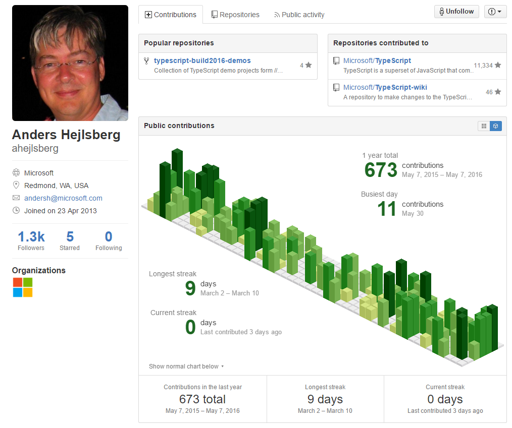
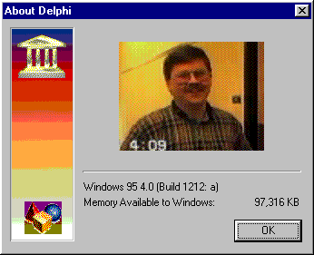
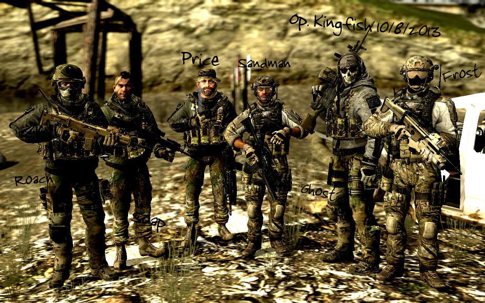

《Borland传奇》这本书写于2003年，距今年（2016年）已经有13年了，但是读起来依然精彩。刚开始看到这本书的名字，还以为是讲波兰这个国家的故事（英语太渣），后来查了一下词典，波兰的英文名是Poland，而Borland，是一家软件公司的名字，中文译名宝蓝。这本书讲的啥？讲的是Borland这家软件公司从诞生到2003年这期间的发展故事。故事写到最后，Borland的传奇仍在继续，然而2009年，Borland就被Micro Focus收购了，让人不禁感叹。对于我这种90后并且入行如此之晚的人来说，如果不是翻开了这本书，估计不会知道Borland这家公司，这也从另外一个侧面反映出Borland确实走了下坡路，当然也有可能是因为我孤陋寡闻。但是正如书中所说，“即便没有经历过那段美好的回忆，那也可以把这些内容当成一个有趣的故事来读吧”。

**这本书是讲Borland这家公司的故事，也是讲PC发展的历史故事。**

绕来绕去，还是绕不开Microsoft这个PC时代的霸主。相对来说，这本书的技术性还是有的，毕竟是讲一家技术性公司的发展历史。通篇读完，大体感觉是，对Borland的那些开发工具记得不太清楚，乃至哪个层面的，也分得不太清楚，因为时至今日，自己接触得比较少。只是大概知道Borland搞出了Turbo Pascal、Delphi、BorlandC/C++、JBuilder这一系列在当时很有名的开发工具。大学的时候学C语言，提到一个叫Turbo C的编译器，这个就是Borland公司的产品。PC时代能正面扛Microsoft伤害的公司屈指可数，Borland是其中之一，并且还活了下来，过程所经历的行业竞争的惨烈，前所未有，毕竟一个单纯做开发工具的厂商和做操作系统的厂商竞争，本身就不公平，后者掌握的资源巨大。书中也提到了一些竞争过程中的有趣故事，比如前期Borland计划推出Windows版本的Borland Pascal的时候，连Microsoft的Windows API大师Charles Petzold（就是那个写了《编码：隐匿在计算机软硬件背后的语言》和《Windows程序设计》的大师）都认为Borland不可能做出来，结果Borland不但做出来了，而且还非常的畅销，简直跌破眼镜。另外一个小插曲是当时Microsoft的一位工程师（猜测）因为痛恨在开发工具方面搞不过Borland，经常在Microsoft自身的开发工具刊物上发表文章嘲笑Borland，笔名Buck Forland（把B和F对调一下，简直太嘲讽了）。后来的故事就是Microsoft到Borland挖角，所以这本书也可以算是讲Microsoft的发家史，Borland为Microsoft培养工程师的故事（笑），书中的一段描述：
>由于Microsoft在许多的开发工具战役中一直被Borland打得灰头土脸，更何况Borland C/C++3.1几乎抢占了大部分的市场，因此Microsoft便开始准备好好地对付Borland。但是由于其时Borland在编译器的技术领域领先了Microsoft数年之久，Microsoft无法在短时间之内赶上Borland，所以Microsoft决定使用最有效的方法立刻追上Borland的技术，那就是直接从Borland挖角。结果，后来Microsoft的Visual C/C++小组有60％的成员是从Borland挖来的，这个举动不但立刻让Borland流失了大量的优秀技术人才，也在数年之后造成了Borland控告Microsoft的导火线。

除此之外，通过这本书，还能够一窥Java和.Net战争的起源、思考自己的软件道路。摘录书中的一小节：
>##**软件高科技公司的命运**
如果读者是在信息产业经历了一段时间， 那么可以观察到目前著名软件公司在经营上风格的异同。每一家公司在成立之初，创办者都有特定的理想或是技术，软件公司也一样。不过随着公司的成长和发展，软件公司的风格却逐渐地出现差异。 我说的风格当然不是指每一家的企业文化， 这当然会有不同，我指的是软件公司的创始人目前是否仍然是这家公司的主要负责人。

>美国企业喜欢并购，许多公司的创始人也喜欢在公司有了一点成就之后立刻卖出公司，以股票换钞票，许多的美国公司董事会也喜欢动不动就换CEO。这造成许多公司的CEO只注重炒短线的工作，只想把公司股票价格炒高，然后卖了公司就闪人。如此做法会让软件公司的产品和营运快速地走下坡路。Borland就历经过这种CEO。但是请读者观察，只要是公司创办人仍然还在掌舵或是担任重要职位的软件公司，对于产品就会坚持，不会随意以炒股票来恶搞。例如以Microsoft来说，虽然这是一家饱受争议的公司，但是她的创始人Bill Gates仍然掌握Microsoft，因此Microsoft仍然在源源不断地开发产品和提出新的构想。不管这些产品是好是坏，我们都不可否认，Bill Gates仍然在努力地实现他的理想，即使一般大众都认为这是狼子野心。这让Microsoft持续地保有活力和竞争力。

>再比如，Oracle的创始人Larry Ellison仍然执掌Oracle。虽然Larry Ellison也是属于好大喜功的人，但是我们不可否认，在Larry的领导下，Oracle仍然振奋向前。这些现象可以从其他的、正在力争上游的软件公司看出，例如Developer Express、Atozed software以及目前正和Microsoft在多媒体市场打得不亦乐乎的RealPlayer等，这些公司的特点便是对于产品的努力和坚持。

>反观一些走下坡或是关闭的公司，其中许多都是由于公司的创始人离开而导致。 例如以前著名的数据库厂商Informix，就是由于创始人Roger Sippl卖掉Informix的股票另起炉灶。后继者对于公司没有热忱，最后因为经营不善而终于成为历史。Informix如此，Netscape又何尝不是呢？Netscape被American Online并购之后，快速地走下坡路。前一阵子我看到的新闻消息指出，目前Netscape在全世界的占有率只剩下3％。这个曾经占有超过90％市场并给予Microsoft强烈威胁的浏览器巨人，也在创始人离开之后消声匿迹，逐渐被人淡忘，真是令人不胜唏嘘。

>Philippe Kahn的Borland是只会做产品的公司，Delbert Yocam时的Borland只会短线操作，以致让Borland快速走下坡路。现在，Borland在Dale Fuller的主掌之下好不容易地回稳，并且在2001/2002年全世界不景气之中仍然呈现稳健的成长，算是相当难能可贵的。Dale Fuller虽然不是Borland的创始人，但是似乎对于经营Borland真的发生了兴趣，愿意管理Borland，也愿意投入心力规划Borland的产品线，是相当认真的CEO。Borland在经过了多年之后终于找到了一位不错的CEO，希望Dale Fuller能够以公司创始人般的热忱，带领Borland再创另外一个高峰。

>当然，公司创始人是否仍然是软件公司的重要人物不是判断一间软件公司唯一的指针。如果软件公司能够适当地吸引专业的管理人才来改善公司的体制是很好的事情，因为这样的公司有可能结合创新的理想，对产品的坚持以及有效率的专业管理，这是对公司以及使用者最好的保障。没有了创始人的存在，软件公司总是少了一股对于理想的坚持，不是吗？

历史总是如此的相似，今天很多互联网公司不也是这样么？

**这本书是讲Borland这家公司的故事，也是讲那些可敬的Borland工程师的故事。**

**Carl Quinn**， Borland C／C++、dBuilder的Framework大将，以下是书中关于Carl Quinn的描述：
>Carl Quinn在Microsoft Visual C/C++1．0推出之后，立刻奉命开发一个能够和MFC 相抗衡的全新OWL，而Carl Quinn也是数年后JBuilder的JBCL Framework的灵魂开发人物。Carl Quinn不但负责开发OWL，也为Borland在组件Framework的技术领域做出了重要的贡献。由于 Carl Quinn的投入，开启了OWL大战MFC、Borland C/C++缠斗Visual C/C++数年精彩好戏的序幕。

**Eugene Wang**，越南人，Borland C/C++ 3.1之前的产品经理，一手把Borland C/C++带到了当时世界第一的地位。后来因为和老板Philippe Kahn闹翻，出走到竞争对手公司Symantec，还是搞出了当时非常著名的Symantec C/C++。

**Anders Hejlsberg**，Borland创始人（负责技术）之一，和老板Philippe Kahn基情无限，注意到书中提到这样一个细节：
>当年Philippe Kahn和Anders Hejlsberg到美国准备开始创业时，由于没有资金，Philippe
Kahn就在西餐厅打工，负责端盘子的工作，而Anders Hejlsberg则努力的在开发Turbo Pascal。

后来被Bill Gates以300万美元年薪挖到Microsoft（Philippe离开Borland之后不久），Delphi、C#之父、.Net Framework Core Architect，年轻时曾在丹麦技术大学学习工程，但没有毕业。生于1960年，今年（2016年）56岁，现在继续在Microsoft负责TypeScript项目，这是大师最近一年commit代码到github的timeline（哪一天没有commit代码显示白色，柱子越高越绿代表哪天commit代码的次数越多），简直看得人热泪盈眶！下次有人问我“做技术能做一辈子？”的时候，我就直接show这个图，不解释。



书中关于Anders技术水平的一些细节描述：
>由于Turbo/Borland Pascal以及Delphi的最佳化编译器都是Anders Hejlsberg撰写的，因此当Anders离开Borland之后几乎没有人能够维护编译器程序代码。Anders都是使用汇编语言(Assembly)撰写复杂的编译器程序代码，而且其品质是如此之好，不但连Chuck Jazdzewski都赞不绝口， 更麻烦的是当时Borland几乎没有工程师敢随便更动这些程序代码。

**Chuck Jazdzewski**，早期负责设计Delphi使用的组件Framwork，Anders的老搭档，后来被评为Borland的首席科学家。又是一位十分低调的master，书中描述的一个彩蛋：
>在Delphi 4中，使用者只要开启About对话盒，并且按下"Alt+chuck"，那么就可以看到下图的画面。这个简短的画面是Delphi R&D成员之一偷偷使用V8录下来并且放入Delphi 4中的，这也是第一次Chuck露脸于全世界。Chuck事先并不知情，而在以往的Delphi 1/2/3中放的人物图片则一直是Anders。这些隐藏的有趣图片以及Delphi R&D开发小组的名单在Delphi中称为"Eastern Eggs"。

>

我看的是电子版，没有图片，以上图片是google出来的，应该是这张。

**Danny Thorpe**，Borland RAD核心支柱、Delphi 5开发负责人，Delphi 4被CEO Delbert搞坏之后收拾一堆的烂摊子，敢动上面Anders写的编译器的男人。书中从侧面反映Danny技术水平的一些细节描述：
>Danny在把Delphi的RTL和编译器移植到Linux的过程中发现了一些Linux的bug，因此，当时Danny在Linux的论坛上公布了他发现的bug，并且希望Linux的社群能够修改这些问题，如此一来Borland才能够继续研发Kylix。

>不过，也许是Linux的社群拥有排外的情绪，一直认为Borland不是正统的Linux软件厂商， 因此对于Danny指出的Linux bug也嗤之以鼻， 认为Danny什么都不懂就来说是Linux的bug。由于Linux论坛上的人非常的不友善，而且坚决不承认Danny提出的是bug，因此也惹得Danny非常不高兴，认为做软件的技术人员为何不能就事论事，明明有问题却死不承认。于是Danny便在Linux论坛上和这些人发动了笔战，愈吵愈轰动，最后演变成了两派人马互相批评。

>由于Danny无法在Linux论坛上得到结果和支持，因此一怒之下干脆自己来修改Linux的bug，好让Kylix能够继续开发下去，不再需要这些Linux社群的帮忙。这也是为什么在安装Kylix时，Kylix不但会检查使用者Linux使用的版本，并且会安装Patch档案以修改Linux操作系统的问题。Danny选择了安装额外的Patch档案的方式来解决Linux的bug，而不是直接修改Linux的核心，再由Borland分发Linux Distribution。当时，在Danny解决了Linux执行时期函数库的一些bug之后，Kylix才能够顺利地开发下去。后来，在Kylix小组开发Kylix的集成开发环境时也发现了一些XWindow的bug，Danny也是选择由Borland自己来修改加以解决，而不需要Linux社群的帮忙。

我看完之后自己YY的一段对话：
```
“什么都不懂，竟然敢说是我的问题，明明是你的问题，你行你上啊（嘲讽脸）！”

“懒得争论了，我上就我上！”
```

总的来说，《Borland传奇》这本书写得荡气回肠，讲述Borland各处出击，于PC时代在恶劣的开发工具市场竞争生存的故事，也刻画了很多位大师，让人感受到这家公司就像一个人一样，是鲜活的，颇有一种《三国演义》的味道，从中也能体会到作者对于Borland这家公司的深厚感情。

早期Delphi开发小组开发人员构成：
* Anders Hejlsberg：编译器，Object Pascal 程序语言，产品架构
* Chuck Jazdzewski：Framework，组件架构设计/实现
* Allen Bauer：集成开发环境的开发工具，Open Tools API
* Danny Thorpe：RTL (Run-Time Library)
* Zack Urlocker：产品开发方向，产品规划

我想如果Delphi小组拍个合照的话，应该会有一种《使命召唤—现代战争》的感觉吧，每个人的故事，都可以讲得很长很长...

