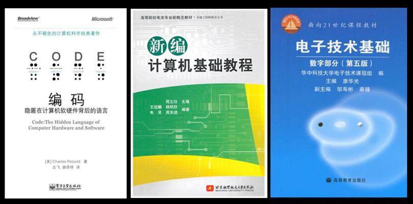

今天状态稍微好了点，花点时间补回上个月的这篇文章，但应该不会写很长。

《编码》这本书本来看了有段时间，6月读的书应该是《禅与摩托车维修艺术》，上周末发烧，上班之后也没啥心情读了，个中痛苦不想多说，对生活又有了不同的感悟，书评留在这个月写吧，当然这都是借口，所以啥也不说是最好的。

《编码》是值得一读的好书、科普书，是带有情怀的书，当然也是与计算机有关，比起单纯的学习数字电路，这本书带有趣味的讲解了很多现实问题，甚至是计算机的历史。记得读大二的时候课堂上我一个同学问老师学习数字电路有什么用，当时我也十分的疑惑，无法给出解答，只知道这门课有用。如果现在要回答这个问题，我会推荐阅读《编码》这本书，读完之后就豁然开朗了。前面的章节是铺垫，第17章是一个升华，用前面章节学习的电路搭了一台简单的计算机，真正的把知识用了起来。这是第一遍阅读，第17章细节的地方我没有深究，大概理解了一下原理，粗粗略过，我知道它前后肯定是没有矛盾的，哪天有时间的话回头再推理或者用FPGA实现一下（笑，我也知道应该是Later equals never了）。另外计算机其实不一定非要用电路来实现（看了这本书你就大概懂了，参考三体人的人阵计算机，笑）。

现在我觉得数字电路入门有三本书一起看应该挺好（完全没有压力，简单易懂，不懂直接跳过，它日回头再看），本科阶段足矣（虽然对找工作并没有什么卵用，笑）—《编码》、周立功写的《新编计算机基础教程》、高等教育出版社出版的《电子技术基础：数字部分》（这个是我读大学时候的教材），按顺序阅读可能会更好（这种感觉应该是先开眼界，再实践，因为实践肯定是会深陷细节，有时候搞不懂在干什么，当然反过来也有反过来的好处，豁然开朗，两种方式选哪种，看个人喜好），看的时候有块面包板搭个电路实践一下效果更好，看周立功那本书可以用汇编玩一下51单片机（不要陷进去就好，我就是个反例，很多细节的东西没时间的话没必要深究，不要以为搞懂了就很厉害，这不是现阶段要做的事，它日接触了更大的计算机世界回头再看眼光会不一样，也节省时间）。

 

以下是《编码》的剧透部分，也是我个人觉得有意思甚至感动的部分（当然全书大部分都是经典），摘录并且脑洞一下，打算开始看这本书的可以略过。

**老橡树上的黄丝带和二进制数**

《老橡树上的黄丝带》是托尼·奥兰多的经典名曲，歌曲描述了一个在监狱服刑的丈夫在即将服刑期满的前夕，因担心远在家乡的妻子不接受他，写信告诉妻子，如果愿意再次接纳他，请在他出狱返家的当天，在家门口的老橡树上系上一条黄丝带；如果没有黄丝带的话，这就会识相的默默离开。结果这位丈夫出狱返家时，家门口的老橡树上绑满了数以百计的黄丝带在空中飞扬，让他十分感动。
这就是简单的二进制传递信息的思想，也是编码、解码的思想，“是”或者“不是”，没有“如果”、“而且”、“但是”，1盏灯的亮灭表示2种情况，2盏灯的亮灭表示4种情况，3盏灯的亮灭表示8种情况...，灯够多，万物皆可编解码（当然前提是用同一本字典去解读），后来啊，前辈们脑洞大开，不一定要用灯，电压也可以，存储器，存起来，1比特、2比特、3比特...

**随机访问存储器**

>一个辛辛苦苦装满65536字节珍贵数据的64Kx8RAM阵列，如果断掉电源，会发生什么事情呢？首先所有的电磁铁都将会因为没有电流而失去磁性，随着“梆”的一声，金属片将弹回原位，所有继电器将还原到未触发状态。RAM中存储的数据呢？它们将如风中残烛般消失在黑暗中。
正因为如此，随机访问存储器也被称为易失性（valatile）存储器。为了保证存储的数据不丢失，易失性存储器需要恒定的电流。

内存跟硬盘的区别，内存和Flash的区别！我家电脑内存1T，哼！

**关于自动操作**

>机器响应指令码做一系列操作的过程称为执行（execute）指令，但这并不能表明机器是一种有生命的东西，因为它不能自行分析机器代码并决定该做什么。

**从算盘到芯片**
>对于构造计算机来说，继电器不是最完美的设备，因为它们是机械性的，利用金属片的弯曲和伸直状态进行工作，而频繁的工作可能导致其断裂，另外如果接触点之间有污垢或者卡住纸屑，也会导致继电器失效。1947年发生了一件著名的事故，人们从Mark II计算机的一个继电器中发现了一只飞蛾。格蕾丝·莫瑞·赫柏（Grace Murray Hopper, 1906-1992）于1944加入了艾肯的团队，日后成为了计算机编程语言领域非常著名的人物。他将上面提到的那只飞蛾用带子绑在计算机日志（logbook）上，并在其边上注明“第一个被发现的有生命的bug”。

早期计算机还真是用继电器做的？重温debug之母的故事，笑。

**用比特来表示文本**

>当考虑用比特来表示文本的时候，切忌好高骛远。我们经常会看到书页上，或报刊和杂志的栏目上所有的内容被整齐地组织在一起。所有的段落都划分为宽度相等的文本行，但我们要注意，这种排版的形式永远只是文本之外的事物。当曾在某个杂志上细细品味过得一个故事，几年后与我们在另外一本书中重逢时，我们回忆起的往往是故事本身而不是文本的排版，没有人会因为行与行间距的不同而把它们当成两个故事。

这算是一个启发性的观点。

经典太多，不一一抄了，翻开读一下《编码》这本书吧。